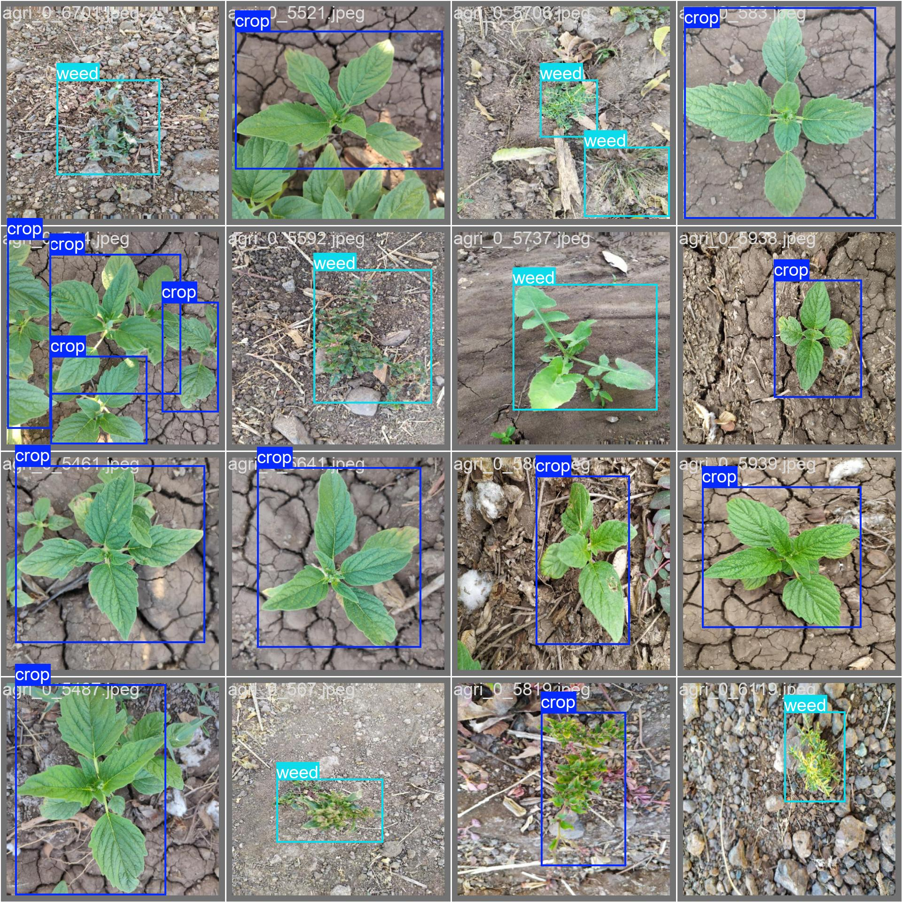

# Crop and Weed Detection using Object Detection Models

## The purpose of this work is to show how different detection models can be used to solve the problem of crop and weed detection

This repository contains a [jupyter notebook](crop-weed-fasterrcnn-resnet50-fpn.ipynb) that presents the results of using various object detection models for recognizing crops and weeds in agricultural environments. 
The dataset on the kaggle on which this task was solved [here](https://www.kaggle.com/datasets/ravirajsinh45/crop-and-weed-detection-data-with-bounding-boxes).

The models evaluated in this study are:

- **Faster R-CNN with ResNet50 FPN (fasterrcnn_resnet50_fpn_v2)**
- **SSD300 with VGG16 backbone**
- **YOLO version 11 large**

The same main hyperparameters were used to train each model:
- optimizer - SGD(lr=0.0005, momentum=0.9, weight_decay=0.0005)
- patience = 3
- epochs = 50

Each model was evaluated using the Mean Average Precision at IoU 0.5 (mAP50) metric to determine their effectiveness in detecting objects in agricultural images.

## Results

The following mAP50 scores were obtained for each model:

- **YOLOv11L**: 0.89
- **Faster R-CNN (fasterrcnn_resnet50_fpn_v2)**: 0.82
- **SSD300VGG16**: 0.81

As the results show, YOLOv11 outperformed other models, achieving a higher mAP50 score, and was also the fastest to train, taking 2.1 minutes and 11 epochs to train. This makes it the most effective model for detecting crops and weeds on this dataset among the presented models.
