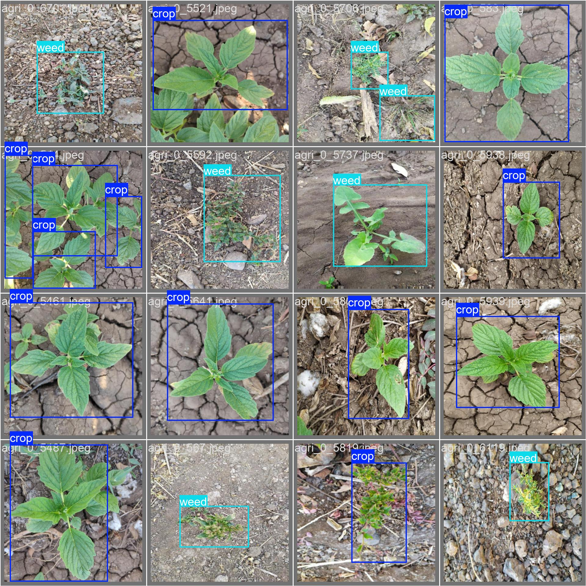

# Crop and Weed Detection using Object Detection Models

## The purpose of this work is to show how different detection models can be used to solve the problem of crop and weed detection

This repository contains a [jupyter notebook](CropAndWeed_detection.ipynb) that presents the results of using various object detection models for recognizing crops and weeds in agricultural environments. 
The dataset on the kaggle on which this task was solved [here](https://www.kaggle.com/datasets/ravirajsinh45/crop-and-weed-detection-data-with-bounding-boxes).

The models evaluated in this study are:

- **Faster R-CNN with ResNet50 FPN (fasterrcnn_resnet50_fpn_v2)**
- **SSD300 with VGG16 backbone **
- **YOLO version 11 large **

Each model was evaluated using the Mean Average Precision at IoU 0.5 (mAP50) metric to determine their effectiveness in detecting objects in agricultural images.

## Results

The following mAP50 scores were obtained for each model:

- **Faster R-CNN (fasterrcnn_resnet50_fpn_v2)**: 0.43
- **SSD300VGG16**: 0.12
- **YOLOv11L**: 0.86

As shown in the results, YOLO11L outperformed the other models with a significantly higher mAP score, making it the best performing model for crop and weed detection on this dataset among the presented models.
